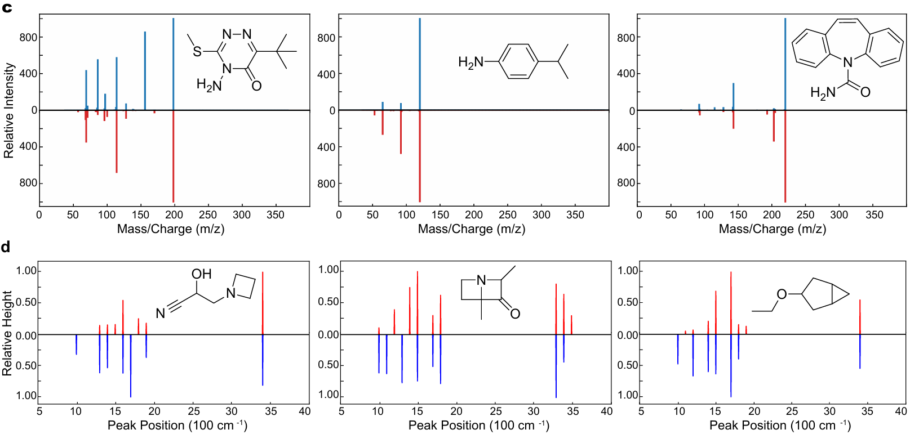
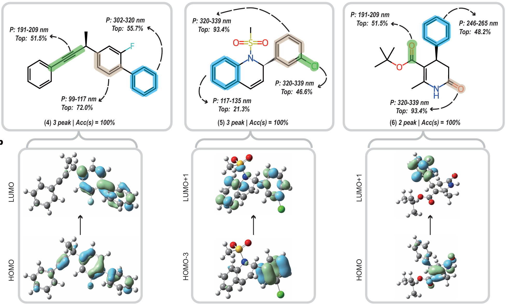

<p align="center">
    
<p>
<h2 align="center"> <a href="">Decoupled peak property learning for efficient and interpretable ECD spectra prediction</a></h2>
<h4 align="center"> <a href="">Accepted by Nature Computational Science 2025</a></h4>
<h5 align="center"> If you like our project, please give us a star ⭐ on GitHub for the latest update.  </h2>


<h5 align="center">
    
[](https://assets-eu.researchsquare.com/files/rs-4470356/v1_covered_b04b4a73-ba42-47cb-9a12-cb1487234cc4.pdf?c=1718087952)
[](https://github.com/HowardLi1984/ECDFormer/blob/main/LICENSE)
[](https://github.com/HowardLi1984/ECDFormer/blob/main/DATASET_LICENSE) <br>

</h5>

## 📰 News

* **[2025.1.12]** 🤝 We have released the ECD and IR spectra data at https://huggingface.co/datasets/OzymandisLi/ECDFormer_Datasets.
* **[2024.12.31]** 🤝 We have released the IR prediction codes.
* **[2024.12.25]** 🔥 Our ECDFormer has been accepted by Nature Computational Science!
* **[2024.12.21]** 🤝 We have released the ECD prediction codes for natural product and multi-chiralty molecules.

## 😮 Highlights

ECDFormer exhibits rearkable spectra modeling capability for molecule structure and IR, ECD, Mass spectra.

### 💡 Well performance and Generalization for spectra modeling and prediction
- With **the decoupled peak property learning algorithm**, we enable the ECDFormer to model spectra from discrete perspective, which is suitable for multiple spectra types including IR, ECD, and Mass spectra. 

### 🔥 Well Explanability for spectrum peaks
- The decoupled peak property learning module facilitates the modeling and visualization of the relative relationships between spectral peaks and molecular functional groups, addressing the issue of interpretability in spectral prediction.

<!--  -->

## 🛠️ Data Preparation
For training and inference, please download the [IR&ECD spectra](https://huggingface.co/datasets/OzymandisLi/ECDFormer_Datasets) and put them into the folder datasets/
please download and put the [descriptor_all_column.npy](https://drive.google.com/file/d/1MHRkm4Jp4SBafwSFXyxsh1H2UdE2cEDc/view?usp=sharing) into the folder utils/
```bash
utils/descriptor_all_column.npy
```

## 🛠️ Requirements and Installation
* Python == 3.8
* Pytorch == 1.13.1
* CUDA Version == 11.7
* torch_geometric, torch-scatter, torch-sparse, torch-cluster, torch-spline-conv
* Install required packages:
```bash
git clone git@github.com:HowardLi1984/ECDFormer.git
cd ECDFormer
pip install -r requirements.txt
```
PS: you can follow this [link](https://blog.csdn.net/qq_51392112/article/details/130171786) for faster torch_geometric install
```bash
## First install these related packages
pip install torch-scatter -f https://pytorch-geometric.com/whl/torch-${TORCH}+${CUDA}.html
pip install torch-sparse -f https://pytorch-geometric.com/whl/torch-${TORCH}+${CUDA}.html
pip install torch-cluster -f https://pytorch-geometric.com/whl/torch-${TORCH}+${CUDA}.html
pip install torch-spline-conv -f https://pytorch-geometric.com/whl/torch-${TORCH}+${CUDA}.html

## Then install the torch-geometric package
pip install torch-geometric

```

## 🗝️ Train and Inference

The training and inferencing instruction for **ECD spectra** is in [main_func_pos.py](main_func_pos.py). 

For training the ECDFormer:
```bash
CUDA_VISIBLE_DEVICES=${0/1/2/3} python main_func_pos.py --model_name gnn_allthree --batch_size 256 --emb_dim 128 --epochs 1000 --lr 1e-3 --mode Train
```
For inference using the model's 400 epoch checkpoint:
```bash
CUDA_VISIBLE_DEVICES=${0/1/2/3} python main_func_pos.py --model_name gnn_allthree --batch_size 256 --emb_dim 128 --epochs 1000 --lr 1e-3 --mode Test --visual_epoch 400
```
To visualize the excellent spectra predictions or generate Atom-Attention-Weight for molecules:
```bash
CUDA_VISIBLE_DEVICES=${0/1/2/3} python main_func_pos.py --model_name gnn_allthree --batch_size 256 --emb_dim 128 --epochs 1000 --lr 1e-3 --mode Visual --visual_epoch 500
```
For further experiments, to predict the molecules from natural products or multi-chiralty-centric molecules, set the mode to ``Real`` or ``multi_carbon``:
```bash
CUDA_VISIBLE_DEVICES=${0/1/2/3} python main_func_pos.py --model_name gnn_allthree --batch_size 256 --emb_dim 128 --epochs 1000 --lr 1e-3 --mode ${your mode} --visual_epoch ${your ckpt epoch}
```

The training and inferencing instruction for **IR** spectra is in [main_ir.py](main_ir.py). 

For training and testing on the IR spectra dataset, set mode to ``Train`` or ``Test``:
```bash
CUDA_VISIBLE_DEVICES=7 python main_ir.py --model_name gnn_ir --batch_size 128 --emb_dim 256 --epochs 360 --lr 1e-3 --mode ${your mode}
```
To visualize the excellent spectra predictions or generate Atom-Attention-Weight for molecules:
```bash
CUDA_VISIBLE_DEVICES=6 python main_ir.py --model_name gnn_ir --batch_size 128 --emb_dim 256 --epochs 360 --lr 1e-3 --visual_epoch 320 --mode Visual
```

## 🚀 Experimental Results
**Quantitively**, we propose the experimental results on our ECDFormer framework and the corresponding baselines including machine learning models and deep learning models. Focusing on peak property prediction, our ECDFormer model surpasses baselines under all evaluation metrics.
<p align="center">
    
<p>

## 🚀 Generalization and Interpretation
ECD spectra predictions on natural products with pharmaceutical effects from recent journals demonstrate the effectiveness and generalization ability of our ECDFormer.
<p align="center">
    
<p>
The ECDFormer framework has excellent generalizationability on the tandem mass spectra prediction and infrared spectra prediction tasks.
<p align="center">
    
<p>

ECDFormer exhibits commendable interpretability due to its attribute prediction for spectral peak disentanglement. To elucidate the process of how ECDFormer generates spectra, we employed the [**Integrated Gradients**](https://github.com/pytorch/captum) to delineate regions within the entire molecule that contribute most significantly to spectrum generation. We observe that chromophores within the molecules generally contribute significantly to the peaks, which is consistent with the chemical principles of ECD spectroscopy. In the computational results, by examining the characteristic peaks of the ECD spectra for these molecules, we discovered a correlation with specific electronic transitions within the molecules. 
<p align="center">
    
<p>

## ✏️ Citation
<details open><summary>💡 If you find our paper, code, and dataset useful in your research, please consider giving a star ✨. </summary><p>

```BibTeX
@article{li2025decoupled,
  title={Decoupled peak property learning for efficient and interpretable electronic circular dichroism spectrum prediction},
  author={Li, Hao and Long, Da and Yuan, Li and Wang, Yu and Tian, Yonghong and Wang, Xinchang and Mo, Fanyang},
  journal={Nature Computational Science},
  pages={1--11},
  year={2025},
  publisher={Nature Publishing Group US New York}
}
```
</p></details>

<details open><summary>💡 I also have other AI4S projects that may interest you ✨. </summary><p>
    
> [**ProLLaMA: A Protein Language Model for Multi-Task Protein Language Processing**](https://arxiv.org/abs/2402.16445) <br>
> Liuzhenghao Lv*, Zongying Lin*, Hao Li, Yuyang Liu, Jiaxi Cui, Calvin Yu-Chian Chen, Li Yuan, Yonghong Tian <br>
[](https://github.com/PKU-YuanGroup/ProLLaMA)   [](https://arxiv.org/abs/2402.16445) <be>

> [**Navigating Chemical-Linguistic Sharing Space with Heterogeneous Molecular Encoding**](https://arxiv.org/abs/2412.20888) <br>
> Liuzhenghao Lv*, Hao Li*, Yu Wang, Zhiyuan Yan, Zijun Chen, Zongying Lin, Li Yuan, Yonghong Tian <br>
[](https://arxiv.org/abs/2412.20888) <be>

</p></details>
