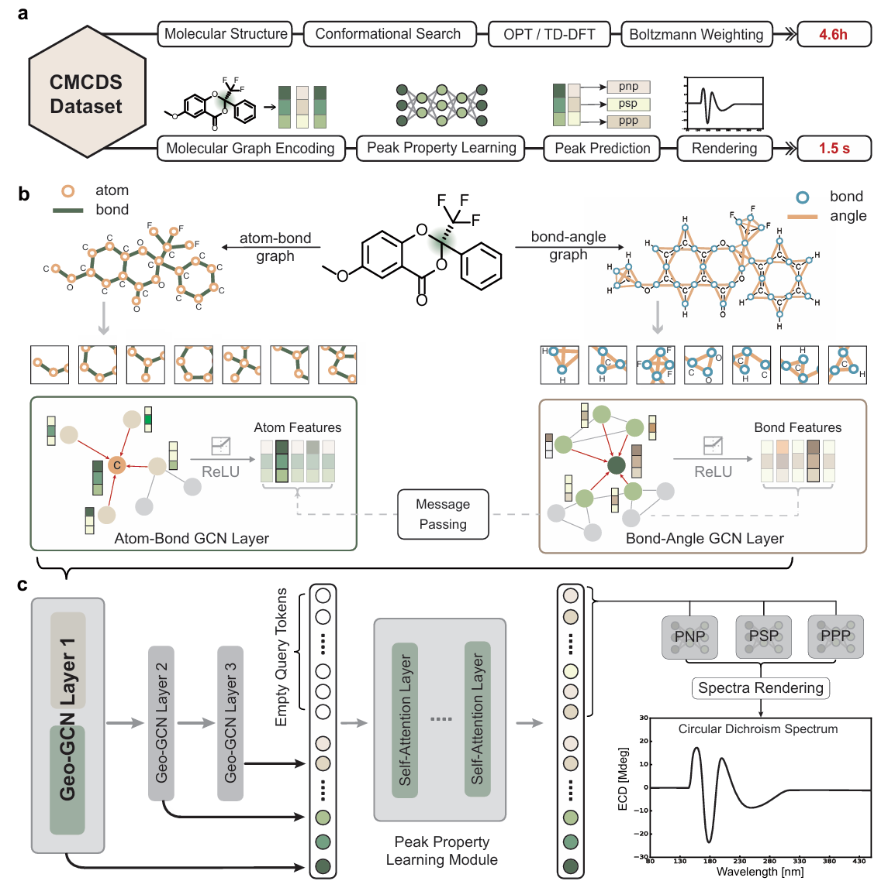
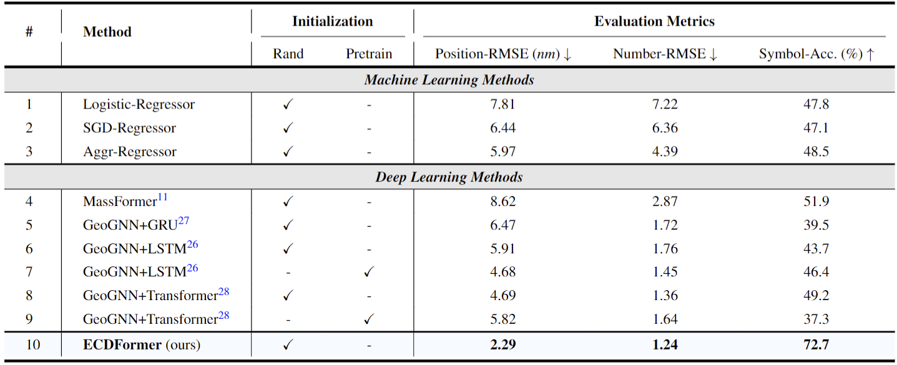
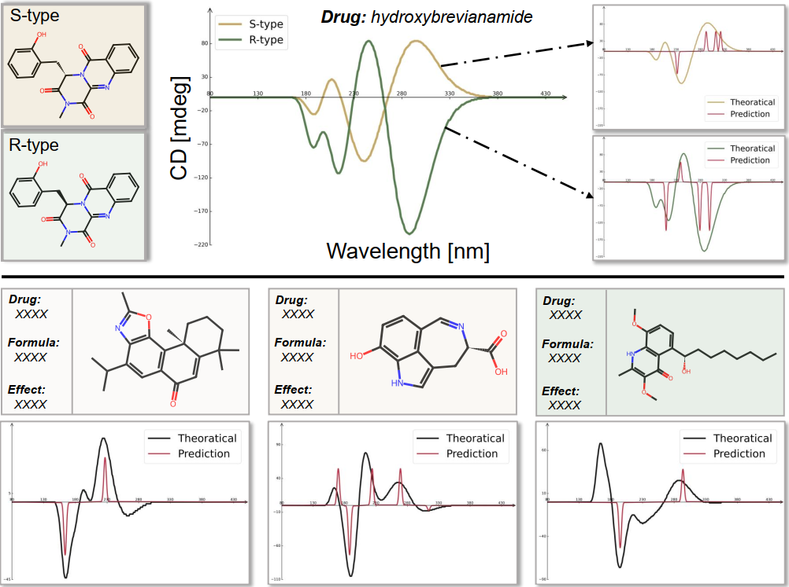

<p align="center">
    
<p>
<h2 align="center"> <a href="">Decoupled peak property learning for efficient and interpretable ECD spectra prediction</a></h2>
<h5 align="center"> The official code for "Decoupled peak property learning for efficient and interpretable ECD spectra prediction" submitted to Nature Computational Science. Here we publish the inference code of ECDFormer. The training code & ECD spectra dataset will be released after our paper is accepted. If you like our project, please give us a star ⭐ on GitHub for latest update.  </h2>


<h5 align="center">
    
[](https://arxiv.org/abs/2401.03403)
[](https://github.com/HowardLi1984/ECDFormer/blob/main/LICENSE)
[](https://github.com/HowardLi1984/ECDFormer/blob/main/DATASET_LICENSE) <br>

</h5>

## Data Preparation
For training and inference, please download and put the [descriptor_all_column.npy](https://drive.google.com/file/d/1MHRkm4Jp4SBafwSFXyxsh1H2UdE2cEDc/view?usp=sharing) into the folder utils/
```bash
utils/descriptor_all_column.npy
```
We will release the CMCDS dataset for training procedure once our paper is accepted.

## 🛠️ Requirements and Installation
* Python == 3.8
* Pytorch == 1.13.1
* CUDA Version == 11.7
* torch_geometric, troch-scatter, torch-sparse, torch-cluster, torch-spline-conv
* Install required packages:
```bash
git clone git@github.com:HowardLi1984/ECDFormer.git
cd ECDFormer
pip install -r requirements.txt
```
PS: you can follow this [link](https://blog.csdn.net/qq_51392112/article/details/130171786) for faster torch_geometric install
```bash
## First install these related packages
pip install torch-scatter -f https://pytorch-geometric.com/whl/torch-${TORCH}+${CUDA}.html
pip install torch-sparse -f https://pytorch-geometric.com/whl/torch-${TORCH}+${CUDA}.html
pip install torch-cluster -f https://pytorch-geometric.com/whl/torch-${TORCH}+${CUDA}.html
pip install torch-spline-conv -f https://pytorch-geometric.com/whl/torch-${TORCH}+${CUDA}.html

## Then install the torch-geometric package
pip install torch-geometric

```

## 🗝️ Train and Inference

The training and inferencing instruction for ECD spectra is in [main_func_pos.py](main_func_pos.py). 

For training the ECDFormer:
```bash
CUDA_VISIBLE_DEVICES=0 python main_func_pos.py --model_name gnn_allthree --batch_size 256 --emb_dim 128 --epochs 1000 --lr 1e-3 --mode Train
```
For inference using the model's 400 epoch checkpoint:
```bash
CUDA_VISIBLE_DEVICES=0 python main_func_pos.py --model_name gnn_allthree --batch_size 256 --emb_dim 128 --epochs 1000 --lr 1e-3 --mode Test --visual_epoch 400
```
To visualize the excellent spectra predictions or generate Atom-Attention-Weight for molecules:
```bash
CUDA_VISIBLE_DEVICES=0 python main_func_pos.py --model_name gnn_allthree --batch_size 256 --emb_dim 128 --epochs 1000 --lr 1e-3 --mode Visual --visual_epoch 500
```
For further experiments, to predict the molecules from natural products or multi-chiralty-centric molecules, set the mode to be ``Real'' or ``multi_carbon'':
```bash
CUDA_VISIBLE_DEVICES=0 python main_func_pos.py --model_name gnn_allthree --batch_size 256 --emb_dim 128 --epochs 1000 --lr 1e-3 --mode ${your mode} --visual_epoch ${your ckpt epoch}
```

## 🚀 Main Results
**Quantitively**, we propose the experimental results on our ECDFormer framework and the corresponding baselines including machine learning models and deep learning models. Focusing on peak property prediction, our ECDFormer model surpasses baselines under all evaluation metrics.
<p align="center">
    
<p>
ECD spectra predictions on natural products with pharmaceutical effects from recent journals demonstrate the effectiveness and generalization ability of our ECDFormer.
<p align="center">
    
<p>

## ✏️ Citation
If you find our paper, code, and dataset useful in your research, please consider giving a star :star: and citation :pencil:.

```BibTeX
@article{li2024decoupled,
  title={Decoupled peak property learning for efficient and interpretable ECD spectra prediction},
  author={Li, Hao and Long, Da and Yuan, Li and Wang, Yu and Tian, Yonghong and Wang, Xinchang and Mo, Fanyang},
  year={2024}
}
```
